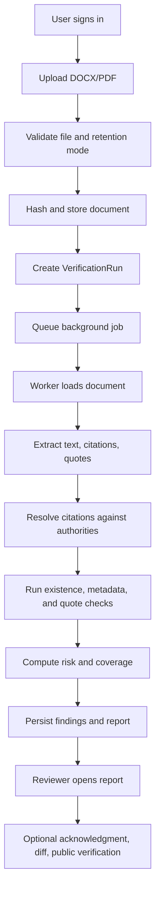

# Legal Citer Application Architecture

## Leadership Summary

Legal Citer is a pre-filing legal citation verification platform. It helps legal teams catch citation, quote, and authority issues before a document is filed, then produces a traceable report with risk level, coverage, document hash, findings, and audit history.

In plain terms: Legal Citer is a quality-control layer for legal filings. It checks whether cited authorities exist, whether citation metadata appears consistent, whether quoted language matches the source, and produces a risk-scored verification report before the document leaves the firm.

## Real-World Value

Legal citation review is usually manual, inconsistent, and expensive. Legal Citer turns that work into a repeatable evidence-backed workflow.

The business value is:

- Lower filing risk by catching bad citations, quote mismatches, unresolved authorities, and source lookup failures earlier.
- Faster legal review by turning scattered manual checks into structured findings.
- Better client and partner confidence through a clear verification report.
- Stronger internal accountability through audit events, reviewer acknowledgment, document hashes, and run history.
- A foundation for compliance-grade filing artifacts, including public verification pages, manifests, certification blocks, and private appendices.

## What The Application Does

1. Authenticates users and scopes work to an organization.
2. Accepts legal document uploads in DOCX or text-based PDF format.
3. Validates file type, file size, retention choice, and document ownership.
4. Hashes and stores uploaded documents.
5. Creates verification runs with pipeline stage tracking.
6. Extracts text, citations, and quoted spans from the document.
7. Resolves citations against authority sources.
8. Runs deterministic verification checks.
9. Scores the run into a risk band and coverage percentage.
10. Produces reports with findings, source metadata, unresolved items, quote issues, and document hash.
11. Supports audit logging, reviewer acknowledgment, diffing between runs, retention policy records, and public verification lookup.

## Architecture Map

### 1. User Experience Layer

The app is a Next.js App Router application. Users sign in, upload documents, start verification runs, monitor run status, and review reports through dashboard pages.

Key files:

- `src/app/page.tsx`
- `src/app/(dashboard)/layout.tsx`
- `src/app/(dashboard)/upload/page.tsx`
- `src/app/(dashboard)/runs/page.tsx`
- `src/app/(dashboard)/runs/[runId]/page.tsx`
- `src/app/(dashboard)/reports/page.tsx`
- `src/app/(dashboard)/reports/[reportId]/page.tsx`
- `src/app/verify/[verificationId]/page.tsx`

### 2. Identity And Tenancy Layer

Clerk handles authentication. The local app reads `userId` and `orgId` through `getAuthContext()`, then maps Clerk organizations to local `Organization` records.

The Clerk webhook creates or updates local organizations when Clerk organization events arrive.

Key files:

- `src/lib/auth-context.ts`
- `src/proxy.ts`
- `src/app/api/webhooks/clerk/route.ts`
- `prisma/schema.prisma`

### 3. API And Control Layer

Next.js route handlers act as the backend API. They accept uploads, create runs, return reports, acknowledge findings, calculate diffs, and expose public verification lookup.

Key files:

- `src/app/api/documents/route.ts`
- `src/app/api/documents/[documentId]/route.ts`
- `src/app/api/runs/route.ts`
- `src/app/api/runs/[runId]/route.ts`
- `src/app/api/reports/route.ts`
- `src/app/api/reports/[reportId]/route.ts`
- `src/app/api/reports/[reportId]/acknowledge/route.ts`
- `src/app/api/diff/route.ts`
- `src/app/api/verify/[verificationId]/route.ts`

### 4. Persistence Layer

Postgres, accessed through Prisma, stores the operational record.

Core entities:

- `Organization`: local tenant record tied to Clerk.
- `Document`: uploaded file metadata, document hash, storage key, owner, and retention mode.
- `VerificationRun`: one verification execution for one document.
- `PipelineStage`: stage-by-stage processing status and output.
- `Finding`: individual check result for a citation or quote.
- `Report`: summarized verification output.
- `AuditEvent`: trace of important actions.
- `RetentionPolicy`: document and artifact retention settings.
- `VerificationManifest`: hash/signature record for public verification.

Key file:

- `prisma/schema.prisma`

### 5. Storage Layer

Uploaded files are currently stored on the local filesystem under an `uploads` directory, with generated storage keys.

This is suitable for local/MVP deployment. For production, this should move to durable object storage such as S3, R2, GCS, or equivalent.

Key files:

- `src/lib/storage.ts`
- `src/lib/files.ts`

### 6. Background Processing Layer

The codebase includes a BullMQ and Redis worker architecture for background verification processing.

Intended flow:

1. API creates a run.
2. API enqueues a verification job.
3. Worker reads the uploaded document.
4. Worker creates an isolated temp workspace.
5. Worker enforces resource limits.
6. Worker runs the verification pipeline.
7. Worker updates run status, findings, reports, and stages.
8. Worker cleans up temporary files.

Key files:

- `src/worker/queue.ts`
- `src/worker/processor.ts`
- `src/worker/index.ts`
- `src/lib/isolation.ts`

### 7. Verification Engine

The verification engine is deterministic first. It does not rely on AI as the primary source of truth.

Pipeline steps:

1. Hash the document.
2. Extract text from DOCX or PDF.
3. Detect citations and quoted spans.
4. Resolve authorities through configured sources.
5. Run verification checks.
6. Compute risk and coverage.
7. Persist findings and report data.

Key files:

- `src/verification/pipeline/runner.ts`
- `src/verification/extractor.ts`
- `src/verification/citations.ts`
- `src/verification/checks/index.ts`
- `src/verification/scoring.ts`

### 8. Authority Resolution Layer

The resolver stack attempts multiple legal authority sources in order:

1. CourtListener, when `COURTLISTENER_API_KEY` is configured.
2. PACER, when PACER credentials are configured.
3. CAP/case.law as a public case-law fallback.
4. Stub resolver returning unresolved.

There is also a GovInfo statute resolver file, but it is not currently wired into `createResolver()`.

Key files:

- `src/verification/resolvers/index.ts`
- `src/verification/resolvers/composite.ts`
- `src/verification/resolvers/courtlistener.ts`
- `src/verification/resolvers/pacer.ts`
- `src/verification/resolvers/pacer-auth.ts`
- `src/verification/resolvers/cap.ts`
- `src/verification/resolvers/govinfo.ts`

### 9. Verification Checks

Current checks:

- `citation_existence`: verifies whether a citation can be resolved by an authority source.
- `citation_metadata`: compares citation metadata against resolved authority metadata.
- `quote_matching`: verifies nearby quoted text against resolved authority content.

Optional/experimental:

- Proposition support analysis exists as a gated, case-law-only AI-assisted path, but it is not part of the core deterministic MVP.

Key files:

- `src/verification/checks/citation-existence.ts`
- `src/verification/checks/citation-metadata.ts`
- `src/verification/checks/quote-matching.ts`
- `src/verification/hybrid-pipeline.ts`
- `src/verification/support-analyst.ts`

### 10. Reporting, Audit, And Compliance Layer

Reports show:

- Risk band.
- Coverage percentage.
- Citation count.
- Quote issue count.
- Unresolved item count.
- Document hash.
- Pipeline stage record.
- Itemized findings.
- Source queried.
- Snippets used.
- AI-assistance marker where applicable.

Supporting compliance utilities include:

- Audit events.
- Reviewer acknowledgment.
- Public verification lookup.
- Verification manifests.
- Filing block generation.
- Jurisdiction-specific certification text.
- Public exhibit and private appendix generation.
- Sensitive data scanning.
- Retention policy helpers.

Key files:

- `src/lib/audit.ts`
- `src/lib/reviewer.ts`
- `src/lib/manifest.ts`
- `src/lib/filing-block.ts`
- `src/lib/certification.ts`
- `src/lib/exhibit.ts`
- `src/lib/sensitive-scanner.ts`
- `src/lib/retention.ts`

## End-To-End Flow

## Current Readiness Notes

This repo contains a credible MVP architecture, but this snapshot has a few implementation gaps to address before positioning it as production-ready:

- The `/api/runs` route creates a queued run and logs that it is enqueuing, but it does not currently call `enqueueVerificationJob()`.
- The pipeline stages created by `/api/runs` use names like `hash`, `extract`, and `citations`; the runner writes names like `hash_document`, `extract_text`, and `run_checks`. That can create inconsistent stage reporting.
- `npm run typecheck` currently fails in `src/lib/auth-context.ts` because Clerk's `orgId` can be `undefined`, while the local type only allows `string | null`.
- Storage is local filesystem based. Production should use durable object storage.
- GovInfo/statute lookup exists as code but is not wired into the resolver stack.
- Manifest, certification, exhibit, retention, and sensitive scanning helpers exist, but not all are invoked by the main verification pipeline.

## Recommended Leadership Framing

Use this positioning:

> Legal Citer is a pre-filing verification platform for legal documents. It gives legal teams a repeatable way to validate citations, compare quoted language against source authority, identify unresolved risk, and produce an auditable verification record tied to the exact document hash.

For non-technical audiences:

> It is like a quality-control checkpoint before filing. Instead of relying only on manual citation review, the system produces a structured report showing what was checked, what passed, what failed, what could not be resolved, and what risk remains.

For technical audiences:

> It is a full-stack Next.js application with Clerk-based tenancy, Prisma/Postgres persistence, local document storage, BullMQ/Redis background processing, deterministic legal citation checks, authority resolver adapters, and report/audit/manifest infrastructure.

## Source Notes

Local source of truth:

- Application routes: `src/app`
- API handlers: `src/app/api`
- Verification engine: `src/verification`
- Operational helpers: `src/lib`
- Worker architecture: `src/worker`
- Data model: `prisma/schema.prisma`

External framework/source checks used for architectural context:

- Next.js App Router and route handlers: https://nextjs.org/docs/app
- Next.js route handlers: https://nextjs.org/docs/app/getting-started/route-handlers
- Clerk Next.js auth and route handler helpers: https://clerk.com/docs/reference/nextjs/app-router/auth
- BullMQ Redis-backed queues and workers: https://docs.bullmq.io/
- CourtListener citation lookup: https://wiki.free.law/c/courtlistener/help/api/rest/v4/citation-lookup
- GovInfo API: https://www.govinfo.gov/developers
- PACER developer resources: https://pacer.uscourts.gov/file-case/developer-resources
